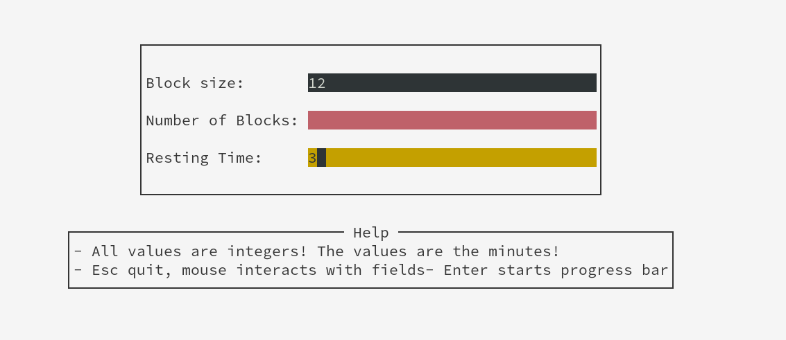
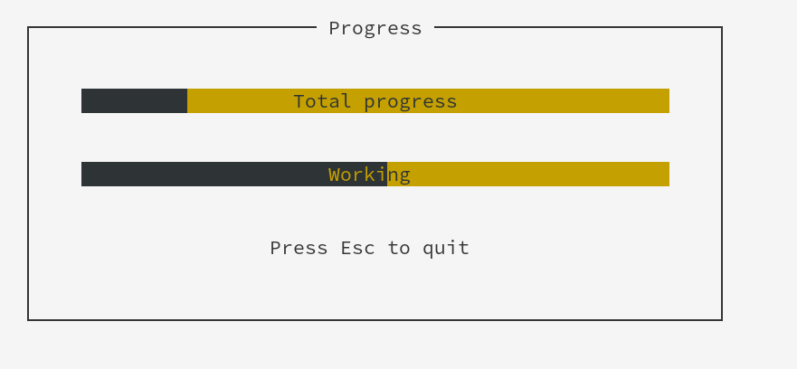

# tui-progress

This project served as an introduction to Brick  to build
TUI. It is based on [this repo](https://github.com/quimpm/timeblocks), and is used
to manage your time with proper rests between. To do this,
it takes three inputs:
- The time you will spend working in each block.
- The number of blocks that you will work.
- The time you will spend resting.

With this inputs, it generates two progress bars, the first tells
the total time you have spend, and the last tells the type of
the current block (rest or work) and the relative time spend
on it.

## Instalation
It does need cabal. To install, run `cabal v2-build`.

If you want to just mess arround, use `cabal v2-run`.

## License
Can be found on [this link](LICENSE)

